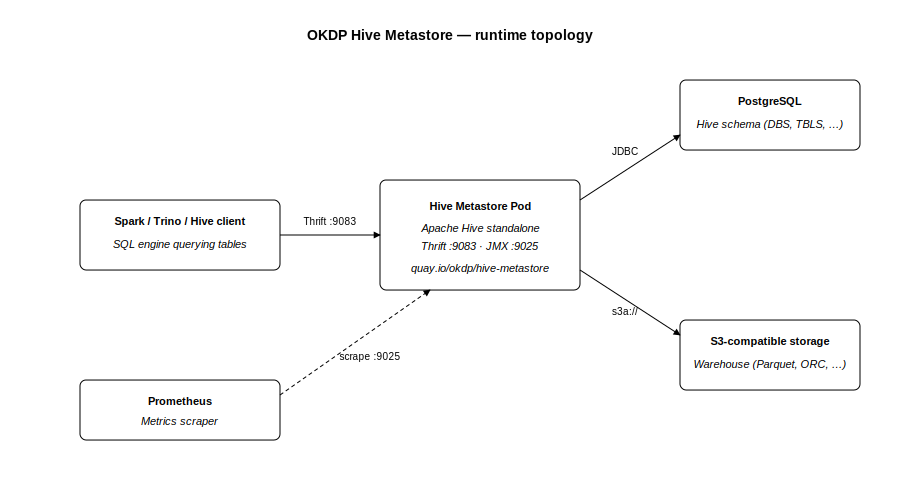

<p align="center">
  <a href="https://okdp.io">
    
  </a>
</p>

[](https://github.com/OKDP/hive-metastore/actions/workflows/ci.yml)
[](https://github.com/OKDP/hive-metastore/actions/workflows/release-please.yml)
[](https://github.com/OKDP/hive-metastore/releases/latest)
[](http://www.apache.org/licenses/LICENSE-2.0)

# OKDP Hive Metastore

Docker image and Helm chart to deploy **Apache Hive Metastore** on Kubernetes. The Hive Metastore is the central metadata catalog of the Hadoop / Spark ecosystem: it lets Spark, Trino and Hive query tables stored on object storage. Intended for data teams running a lakehouse on Kubernetes who need a shared metadata service across their SQL engines.

## Why this project

Apache Hive provides the upstream Metastore service, but no maintained Kubernetes packaging. This repository adds the Docker image and Helm chart needed to run it on Kubernetes, with the operational pieces wired in: schema initialisation, bundled JDBC drivers, object storage configuration, JVM metrics and a default network policy.

Compared with each SQL engine managing its own catalog, a shared metastore lets Spark, Trino and Hive query the same tables on object storage without duplicating table definitions across engines.

## What the project does

- **Docker image**: runs Apache Hive Metastore in standalone mode (Hive 3.x or 4.x).
- **Helm chart**: deploys the image on Kubernetes and creates the database schema automatically on first install.

Together they let Spark, Trino and Hive share a single metadata catalog backed by PostgreSQL/MySQL and S3-compatible object storage.

## Architecture

<p align="center">
  
</p>

**Components in the topology:**

- **SQL engine client** (Spark, Trino, Hive): connects to the Metastore through Thrift on port `9083` to look up table definitions, partitions and warehouse paths.
- **Hive Metastore Pod**: Apache Hive standalone Metastore process running as a Kubernetes `Deployment`. Exposes Thrift on `9083` for clients and JVM metrics on `9025` for Prometheus. Bundles the JDBC drivers, the S3A/GCS connectors and the JMX Prometheus exporter Java agent.
- **PostgreSQL or MySQL**: relational database holding the Hive catalog tables (`DBS`, `TBLS`, `PARTITIONS`, `SDS`, …). Reached over JDBC. Schema is created on first install by the chart's post-install Job running `schematool -initSchema`.
- **S3-compatible object storage**: holds the actual table data (Parquet, ORC, …). The Metastore only stores warehouse paths; SQL engine clients read the data files directly from object storage, without going through the Metastore.
- **Prometheus**: scrapes JVM metrics on port `9025` through the `jmx_prometheus_javaagent` bundled in the image.

For the upstream service design and protocol details, see the [Apache Hive Metastore design documentation](https://cwiki.apache.org/confluence/display/hive/design#Design-Metastore).

## Requirements

- Kubernetes cluster (>= 1.19)
- [Helm](https://helm.sh/) >= 3
- A **PostgreSQL** server reachable from the cluster, with an empty database (the chart's init Job creates the schema automatically)
- An **S3** endpoint reachable from the cluster (AWS S3 or S3-compatible, e.g. SeaweedFS)
- Two Kubernetes Secrets: one for the database password, one for the S3 access key and secret key

Known-good baseline: chart `1.4.0` with image `4.0.1`, Helm 3 and Kubernetes `1.30`. This is the version set validated by the maintainers.

PostgreSQL is the default backend recommended by OKDP because the [okdp-sandbox](https://github.com/OKDP/okdp-sandbox) already provisions a managed Postgres instance through the [CloudNativePG operator](https://cloudnative-pg.io/), and the bundled PostgreSQL JDBC driver is kept up to date in the image. The chart also supports MySQL by setting `db.driverName: mysql`.

### Toolchain tested

| Tool | Version |
|---|---|
| Kubernetes (Kind) | `1.30.0` |
| Kind | `0.23.0` |
| Helm CLI | `3.18.4` |
| kubectl | `1.33.2` |
| Docker | `28.2.2` |

## Quick Start

The chart requires external PostgreSQL + S3 to actually deploy. See [Installation](#installation) below for the full procedure. To quickly verify that the published artifacts are accessible:

```sh
docker pull quay.io/okdp/hive-metastore:4.0.1
helm pull oci://quay.io/okdp/charts/hive-metastore --version 1.4.0
```

### Expected result

```
4.0.1: Pulling from okdp/hive-metastore
Digest: sha256:f68b17b314aa70c03fb2e5e2a1fce4bac142f56a69732cad9e23db439e45e62f
Status: Downloaded newer image for quay.io/okdp/hive-metastore:4.0.1
quay.io/okdp/hive-metastore:4.0.1

Pulled: quay.io/okdp/charts/hive-metastore:1.4.0
Digest: sha256:ecb29c65e0a937175fe3bf51c10e45226d71a84e729662eeea85d8330ccdeef3
```

## Installation

Install on an existing cluster, against a managed PostgreSQL and an S3-compatible endpoint. The procedure below assumes the database, the S3 endpoint and their credentials are reachable from the cluster.

### 1. Create the namespace and the secrets

The chart references two Kubernetes Secrets, one for the database password and one for the S3 access/secret keys. Create the namespace first, then the Secrets in it:

```sh
kubectl create namespace hive-metastore

kubectl -n hive-metastore create secret generic hive-metastore-db \
  --from-literal=password='REPLACE_WITH_DB_PASSWORD'

kubectl -n hive-metastore create secret generic hive-metastore-s3 \
  --from-literal=accessKey='REPLACE_WITH_S3_ACCESS_KEY' \
  --from-literal=secretKey='REPLACE_WITH_S3_SECRET_KEY'
```

### 2. Create a local `values.yaml`

Create a `values.yaml` file in the current directory with at least the database and S3 connection settings. Replace the placeholders with your environment's values. The full list of configurable parameters is in [Configuration](#configuration) below.

```sh
cat > values.yaml <<'EOF'
db:
  host: REPLACE_WITH_POSTGRES_HOSTNAME
  port: 5432
  databaseName: hms
  user:
    name: hms
    password:
      secretName: hive-metastore-db
      propertyName: password

s3:
  url: REPLACE_WITH_S3_ENDPOINT
  warehouseDirectory: s3a://warehouse
  accessKey:
    secretName: hive-metastore-s3
    propertyName: accessKey
  secretKey:
    secretName: hive-metastore-s3
    propertyName: secretKey

image:
  tag: "4.0.1"
EOF
```

### 3. Install the chart

```sh
helm install hive-metastore oci://quay.io/okdp/charts/hive-metastore \
  --version 1.4.0 \
  --namespace hive-metastore \
  -f values.yaml \
  --timeout 10m
```

`--timeout 10m` is recommended on first install (the ~1.3 GB image pull can exceed the default 5 min timeout).

### Expected result

`helm install` returns once the post-install schema-init Job has completed:

```
Pulled: quay.io/okdp/charts/hive-metastore:1.4.0
Digest: sha256:ecb29c65e0a937175fe3bf51c10e45226d71a84e729662eeea85d8330ccdeef3
NAME: hive-metastore
LAST DEPLOYED: <timestamp>
NAMESPACE: hive-metastore
STATUS: deployed
REVISION: 1
TEST SUITE: None
```

The schema-init Job is registered as a `post-install` Helm hook. If `helm install` returned `STATUS: deployed`, the Job ran and completed successfully (Helm would have failed otherwise). The Job is then auto-cleaned by Kubernetes after `ttlSecondsAfterFinished` (60 seconds by default), so it does not appear in `kubectl get jobs` afterwards.

Verify the metastore pods are running:

```
kubectl -n hive-metastore get pods
NAME                              READY   STATUS    RESTARTS   AGE
hive-metastore-...                1/1     Running   0          3m
hive-metastore-...                1/1     Running   0          3m
```

The pod hash suffix (`...`) varies per install.

### Cleanup

Remove the Helm release:

```sh
helm uninstall hive-metastore -n hive-metastore
```

Note that after uninstalling hive-metastore, the schema created in the PostgreSQL database will remain.

If the namespace was created only for this installation, remove it too:

```sh
kubectl delete namespace hive-metastore
```

## Configuration

The full chart values reference is in the [Helm chart README](helm/hive-metastore/README.md). The parameters most commonly customised are listed below. Items marked _(required)_ have no default and must be set for the chart to start.

| Parameter | Description | Default |
|---|---|---|
| `db.driverName` | JDBC driver: `postgresql` or `mysql` | `postgresql` |
| `db.host` | Database server hostname | _(required)_ |
| `db.port` | Database server port | `5432` |
| `db.databaseName` | Database name | `hms` |
| `db.user.name` | Database user | `hms` |
| `db.user.password.secretName` | Kubernetes Secret holding the database password | _(required)_ |
| `db.user.password.propertyName` | Key of the password inside the Secret | _(required)_ |
| `s3.url` | S3 endpoint (e.g. `https://s3.amazonaws.com`, `http://seaweedfs:8333`) | _(required)_ |
| `s3.warehouseDirectory` | S3 bucket used as the Hive warehouse | _(required)_ |
| `s3.accessKey.secretName` | Kubernetes Secret holding the S3 access key | _(required)_ |
| `s3.secretKey.secretName` | Kubernetes Secret holding the S3 secret key | _(required)_ |
| `replicaCount` | Number of metastore pods | `2` |
| `networkPolicies.enabled` | Enable the NetworkPolicy restricting access to port 9083 | `true` |
| `image.repository` | Docker image repository | `quay.io/okdp/hive-metastore` |
| `image.tag` | Image tag (override with a published version, e.g. `4.0.1`) | `latest` |

## Components

| Artifact | Registry | Description |
|---|---|---|
| Docker image | [`quay.io/okdp/hive-metastore`](https://quay.io/repository/okdp/hive-metastore) | Apache Hive standalone metastore, PostgreSQL/MySQL JDBC drivers, S3A connector and JMX Prometheus exporter. Multi-arch `linux/amd64` and `linux/arm64`. Currently published tags: `4.0.1`, `4.0.1-1.4.0`. |
| Helm chart | [`quay.io/okdp/charts/hive-metastore`](https://quay.io/repository/okdp/charts/hive-metastore) | Deployment, init Job, NetworkPolicy, HPA, ServiceAccount, Service and ConfigMap (optional, for `configOverrides`). Current version `1.4.0`. |

## OKDP Integration

Hive Metastore is part of the OKDP data platform stack, packaged as a KuboCD service alongside Trino, Spark and other OKDP services. It can be deployed on the okdp-sandbox Kind cluster as the shared metadata catalog for the platform's SQL engines.

## Alternatives

Hive Metastore is a good fit when Spark, Trino, Hive or compatible engines need a shared catalog for tables on object storage. Other catalog options may be a better fit depending on the table format and governance model:

| Alternative | When to consider it |
|---|---|
| AWS Glue Data Catalog | Managed Hive Metastore-compatible catalog on AWS, with minimal infrastructure to operate. |
| Apache Polaris | REST catalog for Apache Iceberg, shared across Spark, Trino, Snowflake and other engines. |
| Unity Catalog | Centralised catalog and governance layer, primarily used in Databricks-oriented platforms. |

## Contributing & License

Contributions follow the [OKDP contribution guide](https://github.com/OKDP/.github/blob/main/CONTRIBUTING.md). Released under the [Apache License 2.0](LICENSE).

---

**Built 🚀 for the OKDP Community**
<a href="https://okdp.io">
  
</a>
